# Travel Destination Recommendation System

System rekomendacji kierunków podróży wykorzystujący analizę danych, klasteryzację, NLP oraz hybrydowy model rekomendacyjny.

## Opis projektu

Celem projektu jest stworzenie systemu, który rekomenduje kierunki podróży na podstawie preferencji użytkownika.

System uwzględnia m.in.:

- miesiąc podróży,
- preferowaną temperaturę,
- poziom budżetu,
- długość wyjazdu,
- preferencje dotyczące kultury, natury, plaż, kuchni, życia nocnego i innych cech.

Projekt wykorzystuje zarówno dane strukturalne, jak i analizę semantyczną tekstu.

## Zbiór danych

W projekcie wykorzystano zbiór danych zawierający informacje o 560 kierunkach turystycznych z całego świata.

Dane obejmują m.in.:

- miasto,
- kraj,
- region,
- współrzędne geograficzne,
- miesięczne temperatury,
- poziom budżetu,
- sugerowaną długość pobytu,
- oceny cech turystycznych:
  - kultura,
  - przygoda,
  - natura,
  - plaże,
  - życie nocne,
  - kuchnia,
  - miejski charakter,
  - spokój.

## Przygotowanie danych

W ramach przygotowania danych wykonano:

- sprawdzenie braków danych,
- sprawdzenie duplikatów,
- przekształcenie poziomu budżetu do wartości liczbowych,
- rozpakowanie danych o temperaturach miesięcznych,
- utworzenie osobnych zmiennych dla długości wyjazdu,
- zapis przetworzonego zbioru danych.

Po przetworzeniu zbiór zawiera 560 obserwacji i 38 zmiennych.

## Eksploracyjna analiza danych

W ramach EDA przeanalizowano m.in.:

- liczbę kierunków według regionu,
- rozkład poziomów budżetu,
- średnie oceny cech turystycznych,
- korelacje między cechami,
- sezonowość temperatur,
- najlepsze kierunki pod względem wybranych cech.

### Liczba kierunków według regionu

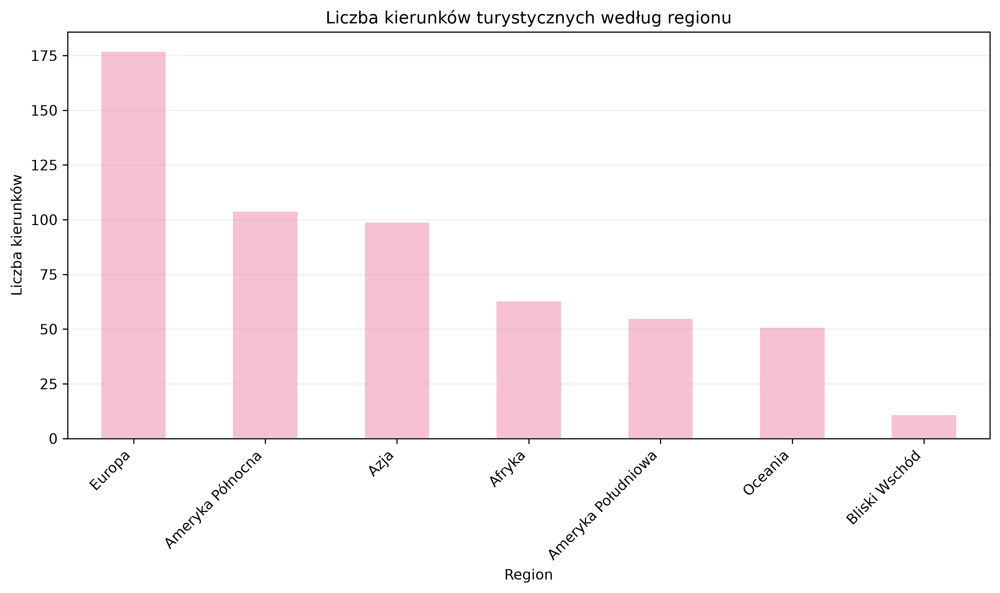

### Rozkład poziomów budżetu

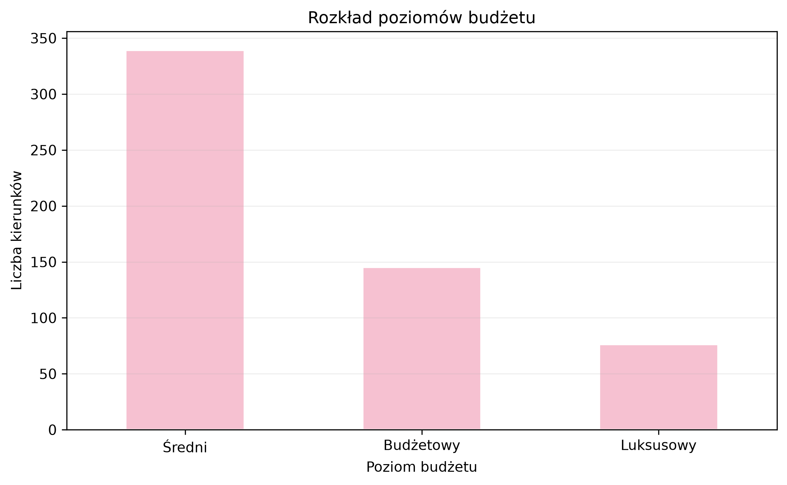

### Średnie oceny cech

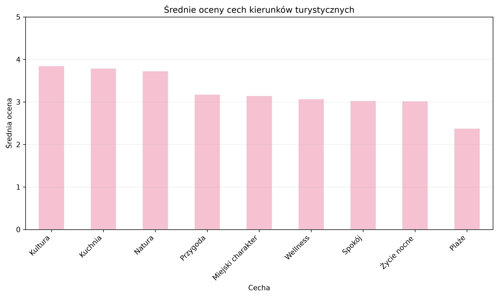

### Korelacje między cechami

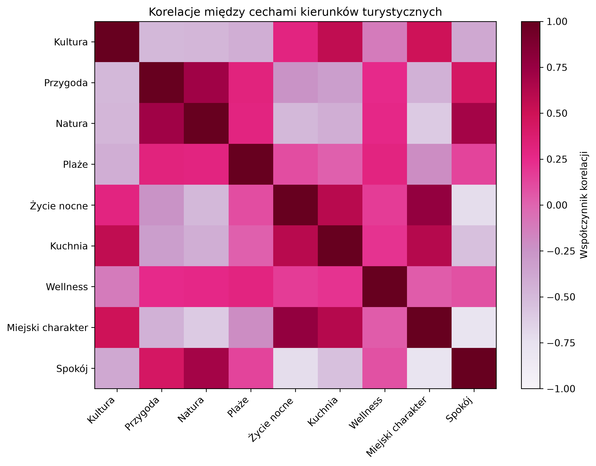

### Średnia miesięczna temperatura

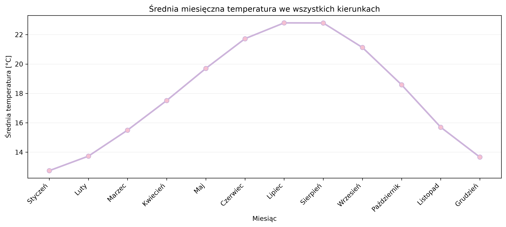

## Klasteryzacja kierunków

Do grupowania kierunków wykorzystano algorytm K-Means.

Przed klasteryzacją dane zostały wystandaryzowane za pomocą `StandardScaler`.

Liczbę klastrów analizowano z wykorzystaniem:

- Elbow Method,
- Silhouette Score.

Najwyższy Silhouette Score uzyskano dla `k = 2`, jednak do dalszej analizy wybrano `k = 4`, aby uzyskać bardziej szczegółowe i interpretowalne grupy kierunków.

### Dobór liczby klastrów

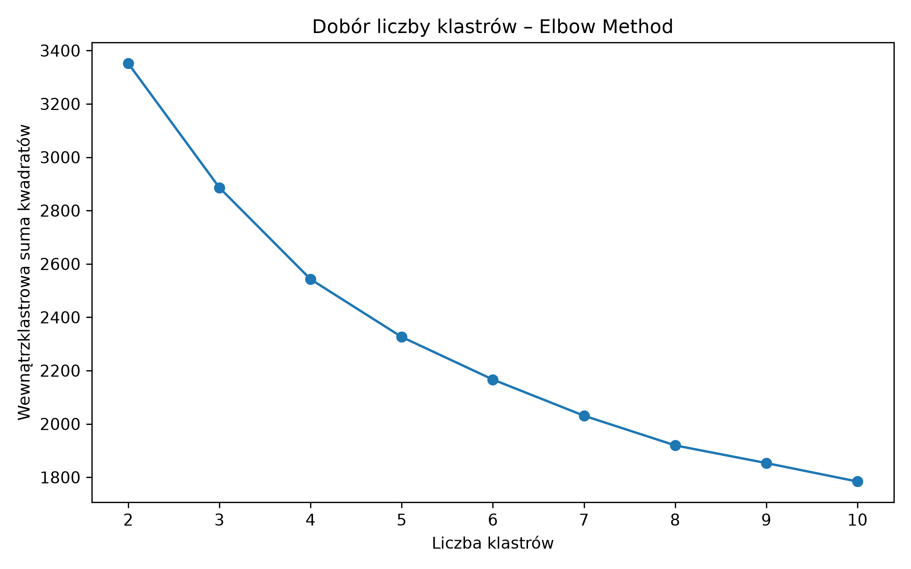

### Ocena jakości klasteryzacji

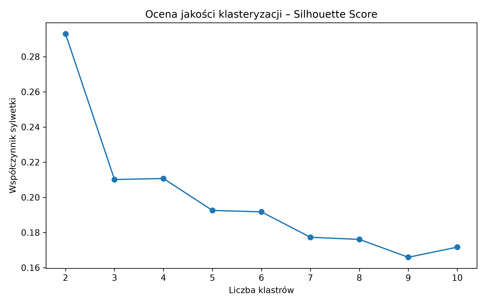

## Profile klastrów

Wyodrębniono cztery grupy kierunków:

1. **Natura i przygoda**
2. **Miejskie i kulturowe**
3. **Spokojne kierunki kulturowe**
4. **Plaże, natura i relaks**

### Profil klastrów

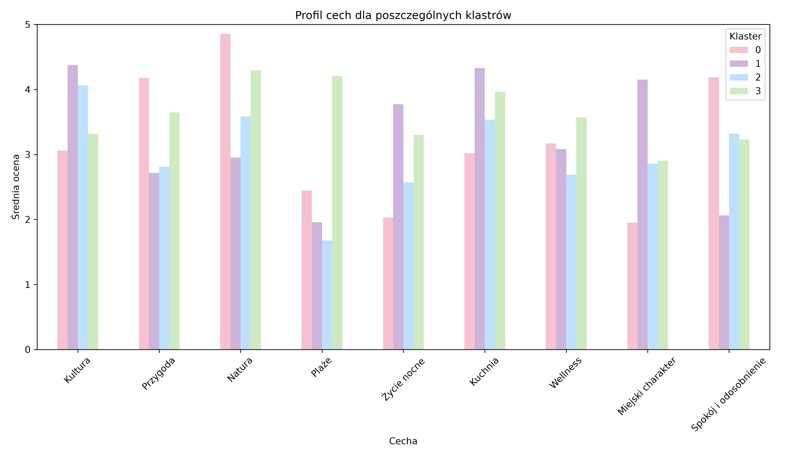

## PCA

Do wizualizacji klastrów wykorzystano metodę PCA.

Pierwsze dwie składowe główne wyjaśniają łącznie około 67,1% wariancji danych.

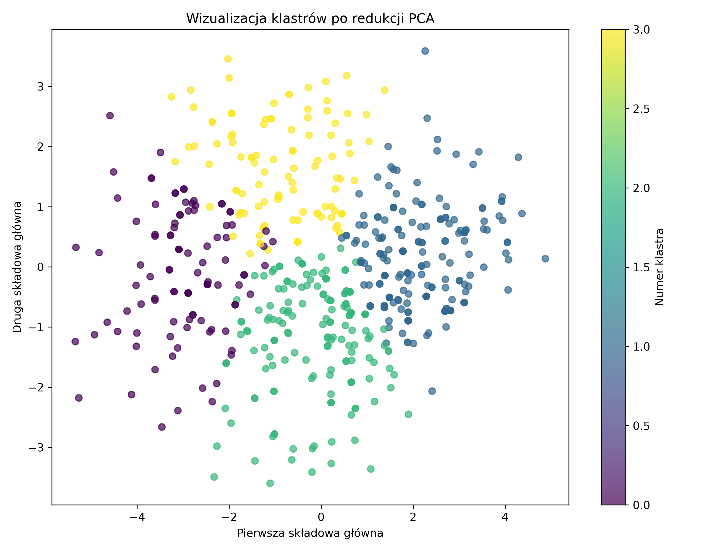

## Klasyczny system rekomendacyjny

Pierwsza wersja systemu rekomendacyjnego wykorzystuje ważoną punktację.

Końcowy wynik zależy od:

- preferencji użytkownika – 55%,
- temperatury – 20%,
- budżetu – 15%,
- długości wyjazdu – 10%.

Każdy kierunek otrzymuje wynik dopasowania, a następnie tworzony jest ranking najlepszych rekomendacji.

## NLP

W projekcie wykorzystano model:

`sentence-transformers/paraphrase-multilingual-MiniLM-L12-v2`

Model generuje embeddingi tekstowe dla opisów kierunków oraz opisu użytkownika.

Podobieństwo między opisami obliczane jest za pomocą cosine similarity.

Dzięki temu użytkownik może opisać swój idealny wyjazd zwykłym tekstem.

## Hybrydowy system rekomendacyjny

Finalny model łączy dwa podejścia:

- 70% – klasyczny system rekomendacyjny,
- 30% – podobieństwo NLP.

Wynik NLP jest wcześniej normalizowany do zakresu od 0 do 1.

Dzięki temu system uwzględnia zarówno konkretne parametry użytkownika, jak i znaczenie jego opisu tekstowego.

## Aplikacja Streamlit

Projekt zawiera również interaktywną aplikację Streamlit.

Użytkownik może ustawić:

- miesiąc podróży,
- preferowaną temperaturę,
- poziom budżetu,
- długość wyjazdu,
- preferencje dotyczące różnych typów aktywności,
- tekstowy opis idealnej podróży.

Aplikacja zwraca:

- TOP 3 rekomendacje,
- TOP 10 kierunków,
- końcowy wynik dopasowania,
- mapę rekomendowanych miejsc,
- profil najlepszego kierunku.

## Podgląd aplikacji

### Ustawianie preferencji użytkownika

Użytkownik może określić m.in. miesiąc podróży, preferowaną temperaturę, budżet, długość wyjazdu oraz preferencje dotyczące różnych typów aktywności.

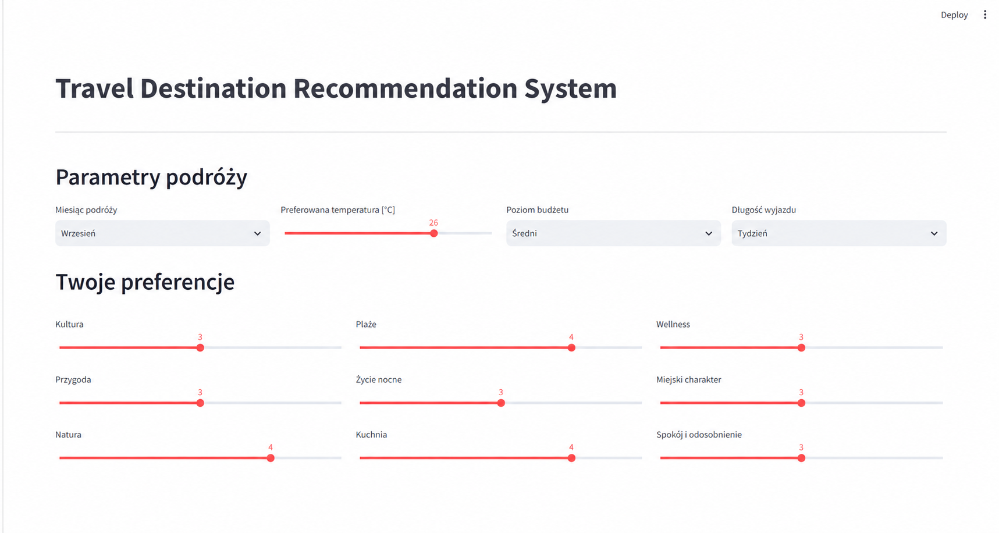

### Wyniki rekomendacji

Po wybraniu preferencji system generuje ranking najlepiej dopasowanych kierunków.

Aplikacja prezentuje TOP 3 rekomendacje oraz bardziej szczegółowy ranking TOP 10.

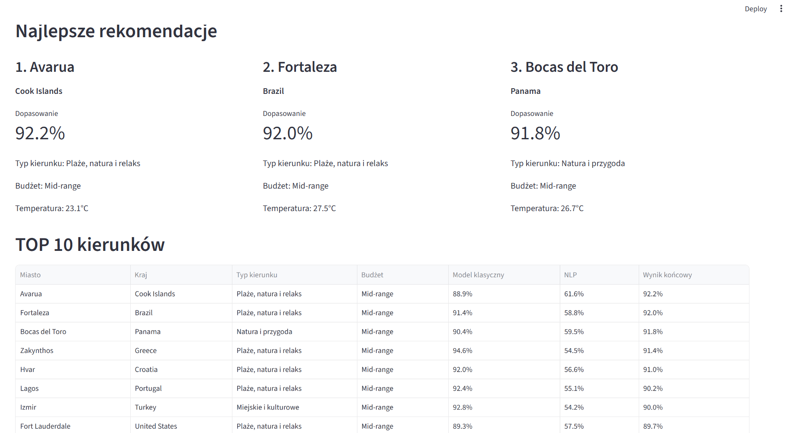

### Mapa rekomendowanych miejsc

Rekomendowane kierunki są również prezentowane na interaktywnej mapie, co pozwala szybko zobaczyć ich położenie.

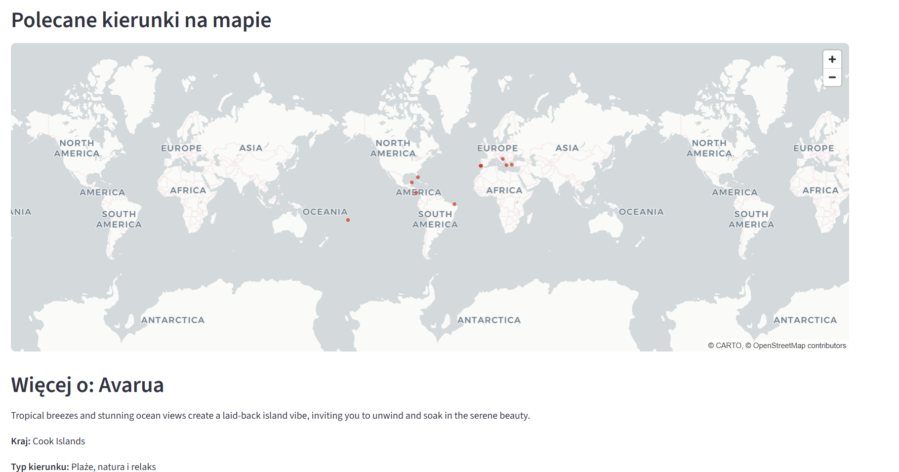


### Uruchomienie aplikacji

```bash
streamlit run app/app.py
```

## Technologie

- Python
- Pandas
- NumPy
- Matplotlib
- Scikit-learn
- K-Means
- PCA
- Sentence Transformers
- Cosine Similarity
- Plotly
- Streamlit

## Struktura projektu

```text
travel_destination_recommender/
│
├── app/
│   └── app.py
│
├── data/
│   ├── raw/
│   └── processed/
│
├── images/
│   ├── kierunki_wedlug_regionu_pastel.png
│   ├── rozklad_budzetu_pastel.png
│   ├── srednie_oceny_cech_pastel.png
│   ├── korelacje_cech_pastel.png
│   ├── srednia_temperatura_miesieczna_pastel.png
│   ├── dobor_liczby_klastrow_elbow.png
│   ├── ocena_klasteryzacji_silhouette.png
│   ├── profil_klastrow.png
│   └── klastry_pca.png
│
├── src/
│   ├── clustering.py
│   ├── data_preprocessing.py
│   ├── exploratory_analysis.py
│   ├── hybrid_recommender.py
│   ├── nlp_recommender.py
│   ├── recommender.py
│   └── utils.py
│
├── README.md
├── requirements.txt
└── .gitignore
```

